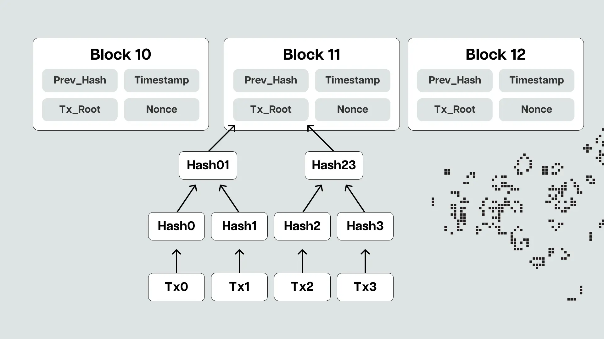

import Logbook from '../../componet/Logbook';
import VocabCard from '../../componet/VocabCard';
import TreeNode from '../../componet/TreeView';

# 📅 12月21号

## 今日任务清单 ✨

<Logbook>
      <Logbook.TaskItem isComplete={true}>📚 学习solidity基础第五章</Logbook.TaskItem>
      <Logbook.TaskItem isComplete={true}>💰 BitCoin And Cryptocurrency 学习</Logbook.TaskItem>
</Logbook>

## 🔗 BitCoin And Cryptocurrency

### 🔐 区块链数据结构

#### 1️⃣ 哈希指针与数据结构
- **哈希指针特点**
  - 不仅存储结构体的地址
  - 还保存了结构体的哈希值
  - 确保数据的完整性

#### 2️⃣ Merkle树结构
1. **基本概念**
   - 使用哈希指针连接区块
   - 提供"Merkle证明"
   - 使轻节点能够验证交易

2. **结构特点** ✨
   - 二叉树结构
   - 叶子节点：单个交易的哈希值
   - 非叶子节点：子节点的哈希值
   - 根节点：所有交易信息的摘要

#### 3️⃣ 去中心化验证

1. **轻节点 (SPV)** 📱
   - **维护信息**
     - 区块头信息（每个约80字节）
       - 版本号
       - 前区块哈希
       - Merkle根
       - 时间戳
       - 难度目标
       - 随机数
     - 仅存储相关钱包交易
     - 最小网络连接信息
   - **特点**
     - 存储需求：几十MB
     - 依赖全节点验证
     - 适合移动设备
     - 安全性相对较低

2. **全节点** 💻
   - **维护信息**
     - 完整区块链数据（500GB+）
     - UTXO集合（未花费交易输出）
     - 内存池（待确认交易）
     - 完整网络信息
   - **特点**
     - 存储需求：数百GB
     - 独立验证能力
     - 适合矿工/交易所
     - 最高安全性

#### 4️⃣ 使用场景对比
1. **全节点应用** 🏢
   - 矿工节点
   - 交易所系统
   - 企业级应用
   - 区块链浏览器

2. **轻节点应用** 📱
   - 移动钱包
   - 个人用户
   - 资源受限设备
   - 普通支付验证

#### 5️⃣ Moral Proof验证
- 清洁点通过请求至节点获取特定交易
- 计算出交易所在区块的根哈希值
- 验证交易确实存在于区块中
- mogo proof验证确保交易不被篡改

#### 6️⃣ 复杂度与安全性
- 复杂度是对数级别
- 证明方法高效
- 哈希指针用于无环数据结构
- 循环链表存在问题

## 📝 英语单词

<VocabCard items={[
  { en: "block header", zh: "区块头" },
  { en: "block body", zh: "区块体" },
  { en: "merkle root", zh: "默克尔根" },
  { en: "timestamp", zh: "时间戳" },
  { en: "previous hash", zh: "前区块哈希" },
  { en: "difficulty target", zh: "难度目标" },
  { en: "version number", zh: "版本号" },
  { en: "coinbase transaction", zh: "铸币交易" },
  { en: "binary tree", zh: "二叉树" },
  { en: "leaf node", zh: "叶子节点" },
  { en: "root node", zh: "根节点" },
  { en: "light node", zh: "轻节点" },
  { en: "block verification", zh: "区块验证" },
  { en: "chain structure", zh: "链式结构" },
  { en: "distributed consensus", zh: "分布式共识" },
  { en: "SPV (Simplified Payment Verification)", zh: "简单支付验证" },
  { en: "full node", zh: "全节点" },
  { en: "light node", zh: "轻节点" },
  { en: "block header chain", zh: "区块头链" },
  { en: "merkle path", zh: "默克尔路径" },
  { en: "verification service", zh: "验证服务" },
]} />

