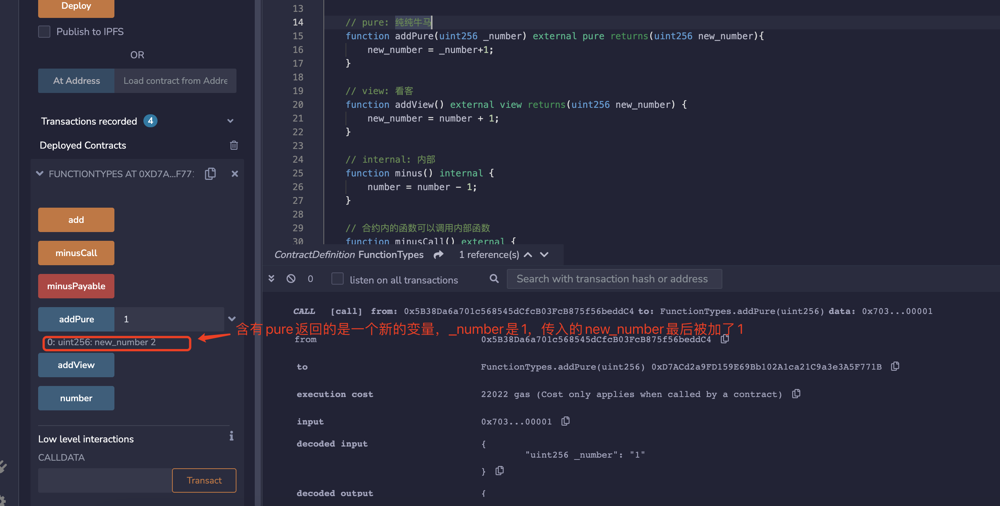
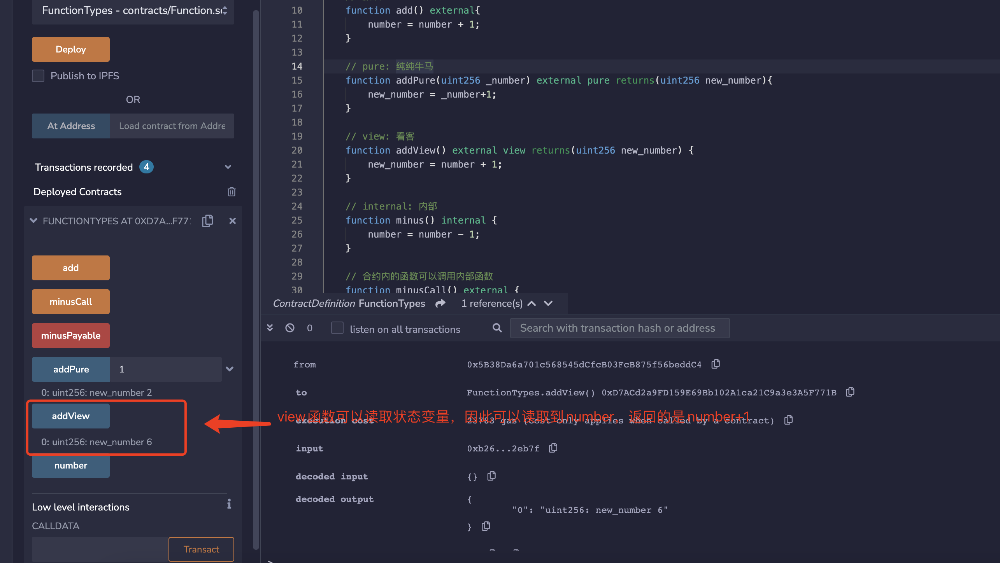
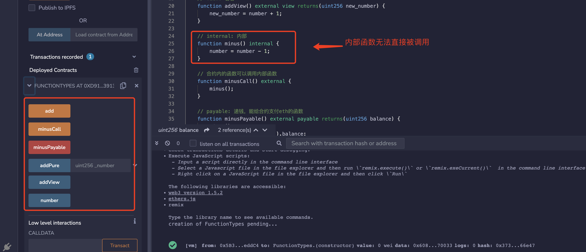
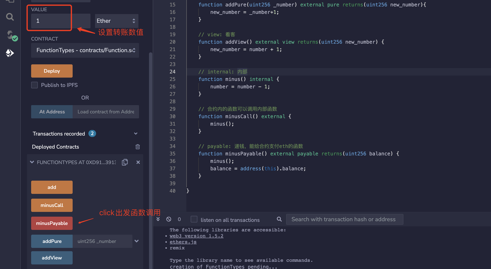

# 函数 🔧 

## 📝 函数形式

```js
function <function name>(<parameter types>) {internal|external|public|private} [pure|view|payable] [returns (<return types>)]
```

1. **`function`**：声明函数的固定用法。要编写函数，需要以 `function` 关键字开头。

2. **`<function name>`**：函数名。

3. **`(<parameter types>)`**：圆括号内写入函数的参数，即输入到函数的变量类型和名称。

4. **`{internal|external|public|private}`**：函数可见性说明符，共有4种：

    - **`public`**：内部和外部均可见。
    - **`private`**：只能从本合约内部访问，继承的合约也不能使用。
    - **`external`**：只能从合约外部访问（但内部可以通过 `this.f()` 来调用，`f` 是函数名）。
    - **`internal`**：只能从合约内部访问，继承的合约可以用。

:::tip 小提示1
合约中定义的函数需要明确指定可见性，它们没有默认值。
:::

:::tip 小提示2
**`public`**、**`private`**、**`internal`** 也可用于修饰状态变量。`public` 变量会自动生成同名的 `getter` 函数，用于查询数值。未标明可见性类型的状态变量，默认为 `internal`。
:::

5. **`[pure|view|payable]`**：决定函数权限/功能的关键字。`payable`（可支付的）很好理解，带着它的函数运行时可以给合约转入 ETH。`pure` 和 `view` 的介绍见下一节。

6. **`[returns ()]`**：函数返回的变量类型和名称。

## 🔍 Pure 和 View 的区别？

刚开始学习 Solidity 时，`pure` 和 `view` 关键字可能令人费解，因为其他编程语言中没有类似的关键字。Solidity 引入这两个关键字主要是因为以太坊交易需要支付气费（gas fee）。合约的状态变量存储在链上，gas fee 很贵，如果计算不改变链上状态，就可以不用付 gas。包含 `pure` 和 `view` 关键字的函数是不改写链上状态的，因此用户直接调用它们是不需要付 gas 的（注意，合约中非 `pure/view` 函数调用 `pure/view` 函数时需要付 gas）。

在以太坊中，以下操作被视为修改链上状态：

1. ✍️ 写入状态变量。
2. 🎉 释放事件。
3. 🏗️ 创建其他合约。
4. 💣 使用 `selfdestruct`。
5. 💸 发送以太币。
6. 📞 调用任何未标记 `view` 或 `pure` 的函数。
7. 🔧 使用低级调用（low-level calls）。
8. 🔢 使用包含某些操作码的内联汇编。

为了帮助大家理解，我画了一个马里奥插图。在这幅插图中，我将合约中的状态变量（存储在链上）比作碧琪公主，三种不同的角色代表不同的关键字。


- **`pure`**，中文意思是“纯”，这里可以理解为”纯打酱油的”。`pure` 函数既不能读取也不能写入链上的状态变量。就像小怪一样，看不到也摸不到碧琪公主。

- **`view`**，“看”，这里可以理解为“看客”。`view` 函数能读取但不能写入状态变量。类似马里奥，能看到碧琪公主，但终究是看客，不能入洞房。

- 非 `pure` 或 `view` 的函数既可以读取也可以写入状态变量。类似马里奥里的 boss，可以对碧琪公主为所欲为🐶。

## 💻 代码示例

### 1. ⚙️ pure 和 view

我们在合约里定义一个状态变量 `number`，初始化为 5。

```js
// SPDX-License-Identifier: MIT
pragma solidity ^0.8.21;
contract FunctionTypes{
    uint256 public number = 5;
}
```

定义一个 `add()` 函数，每次调用会让 `number` 增加 1。

```js
// 默认function
function add() external {
    number = number + 1;
}
```

如果 `add()` 函数被标记为 `pure`，比如 `function add() external pure`，就会报错。因为 `pure` 函数不能读取合约里的状态变量，更不能改写。那么 `pure` 函数能做些什么？举个例子，你可以给函数传递一个参数 `_number`，然后让它返回 `_number + 1`，这个操作不会读取或写入状态变量。

```js
// pure: 纯纯牛马
function addPure(uint256 _number) external pure returns(uint256 new_number) {
    new_number = _number + 1;
}
```



如果 `add()` 函数被标记为 `view`，比如 `function add() external view`，也会报错。因为 `view` 函数能读取，但不能改写状态变量。我们可以稍微改写下函数，读取但是不改写 `number`，返回一个新的变量。

```js
// view: 看客
function addView() external view returns(uint256 new_number) {
    new_number = number + 1;
}
```



### 2. 🔐 internal vs. external

```js
// internal: 内部函数
function minus() internal {
    number = number - 1;
}

// 合约内的函数可以调用内部函数
function minusCall() external {
    minus();
}
```

我们定义一个 `internal` 的 `minus()` 函数，每次调用使得 `number` 变量减少 1。由于 `internal` 函数只能由合约内部调用，我们必须再定义一个 `external` 的 `minusCall()` 函数，通过它间接调用内部的 `minus()` 函数。



### 3. 💰 payable

```js
// payable: 递钱，能给合约支付eth的函数
function minusPayable() external payable returns(uint256 balance) {
    minus();    
    balance = address(this).balance;
}
```

我们定义一个 `external payable` 的 `minusPayable()` 函数，间接地调用 `minus()`，并且返回合约里的 ETH 余额（`this` 关键字可以让我们引用合约地址）。我们可以在调用 `minusPayable()` 时往合约里转入 1 个 ETH。


我们可以在返回的信息中看到，合约的余额变为 1 ETH。




## 🏁 总结

在这一讲，我们介绍了 Solidity 中的函数。`pure` 和 `view` 关键字比较难理解，在其他语言中没出现过：`view` 函数可以读取状态变量，但不能改写；`pure` 函数既不能读取也不能改写状态变量。

🎉 希望这些示例能帮助你更好地理解 Solidity 中的函数及其关键字！
