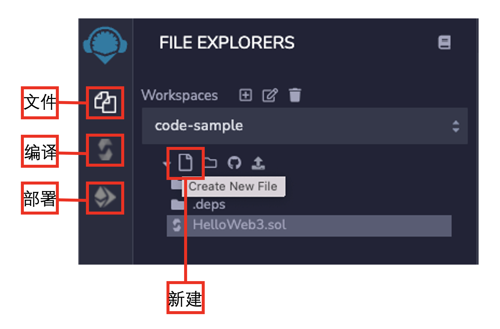
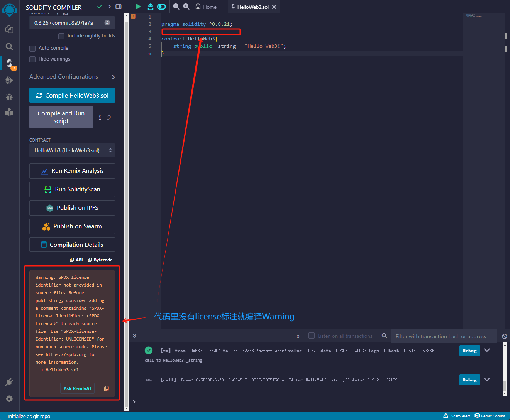
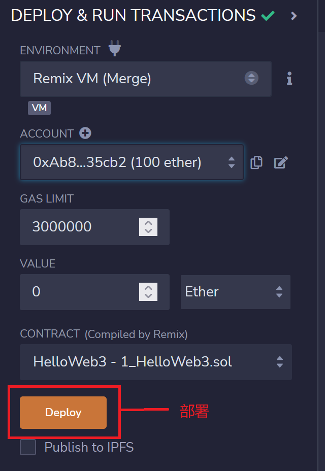

# Hello Web3 🌐

## 开发工具: Remix 🛠️
本教程使用 **Remix** 运行 **Solidity** 合约。Remix 是以太坊官方推荐的 IDE 编译器，可以直接在线运行，无需本地安装，适合入门学习。 

🔗 [Remix 网址](https://remix.ethereum.org)



## 第一个 Solidity 程序 ✨
```js
// SPDX-License-Identifier: MIT
pragma solidity ^0.8.21;

contract HelloWeb3 {
    string public _string = "Hello Web3!";
}

```
## 代码结构解析 📝

1. **第一行注释**：说明了代码所使用的软件许可（license），这里使用的是 **MIT 许可**。如果不写许可，编译时会出现警告（warning），但程序还是可以运行。因此，和其他语言一样，`//` 注释的内容是不被运行的。
   ```solidity
   // SPDX-License-Identifier: MIT

   ```
   

2. 第二行声明源文件所使用的**Solidity**的版本，应为不同版本的语法有些不一致。本代码表示源文件不允许小于`0.8.21`或大于等于`0.9.0`的版本（`0.9.0`这里由编译器决定）。并且Solidity语句必须以`;`结尾。

   ```js
    pragma solidity ^0.8.21;
   ```

3. **第3-4行**:是合约部分。第3部分表示创建合约（contract），声明合约名称为`HelloWeb3`。第4行为合约内容，声明了`string`（字符串）类型的变量 `_string`，并且赋值为`Hello Web3!`。

   ```js
   contract HelloWeb3{
    string public _string = "Hello Web3!";
   }
   ```

## 编译并部署 🚀

在`Remix`编辑代码的页面，按`Ctrl + S`即可编译代码，非常方便。

编译完成后，点击左侧菜单的`部署`按钮，进入部署页面。



默认情况下，Remix 会使用 Remix 虚拟机（以前称为 JavaScript 虚拟机）来模拟以太坊链，运行智能合约，类似在浏览器里运行一条测试链。Remix 还会为你分配一些测试账户，每个账户里有 100 ETH（测试代币），随意使用。点击`Deploy`（黄色按钮），即可部署我们编写的合约。

部署成功后，在下方会看到名为 HelloWeb3 的合约。点击 _string，即可看到 "Hello Web3!"。

## 总结 🏁

本章节主要介绍了 Remix 工具，并且使用 Remix 工具完成了第一个Solidity程序的编写。
