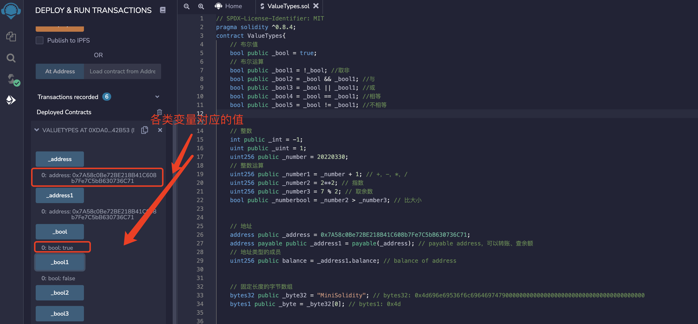
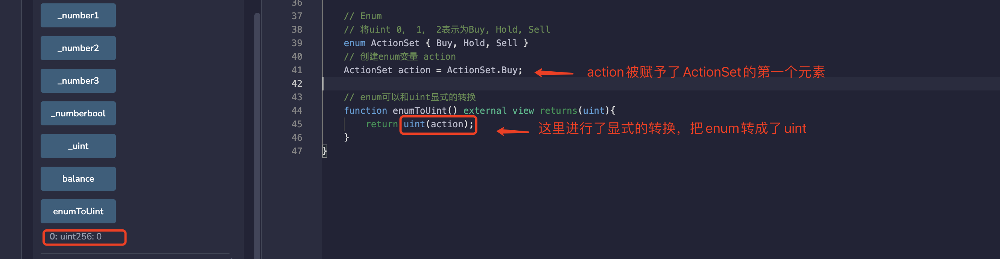
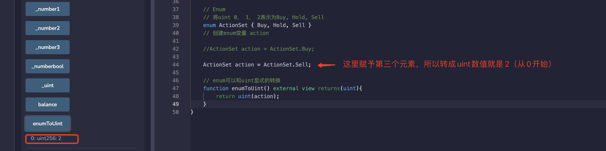

# Solidity中的变量类型

Solidity中的变量类型可以分为三类：

- **值类型（Value Type）**：包括布尔型，整数型等，这类变量赋值时直接传递数值。
- **引用类型（Reference Type）**：包括数组和结构体，这类变量占用较大空间，赋值时传递的是地址（类似指针）。
- **映射类型（Mapping Type）**：存储键值对的数据结构，可以理解为哈希表。

本文将主要介绍值类型。

## 值类型

### 1. 布尔型
布尔型（Boolean）是二值变量，取值为 `true` 或 `false`。🔀

```solidity
// 布尔值
bool public _bool = true;
```

布尔值的运算符包括：
- `!` （逻辑非）❗
- `&&` （逻辑与，"and"）&&
- `||` （逻辑或，"or"）||
- `==` （等于）==
- `!=` （不等于）!=

```solidity
// 布尔运算
bool public _bool1 = !_bool;       // 取非
bool public _bool2 = _bool && _bool1; // 与
bool public _bool3 = _bool || _bool1; // 或
bool public _bool4 = _bool == _bool1; // 相等
bool public _bool5 = _bool != _bool1; // 不相等
```

在上述代码中：
- `_bool` 的取值是 `true` 😃
- `_bool1` 是 `_bool` 的非，为 `false` 🚫
- `_bool && _bool1` 为 `false` 🚫
- `_bool || _bool1` 为 `true` 😃
- `_bool == _bool1` 为 `false` 🚫
- `_bool != _bool1` 为 `true` 😃

**注意**：`&&` 和 `||` 运算符遵循短路规则，这意味着：
- 如果表达式 `f(x) || g(y)` 中的 `f(x)` 是 `true`，则 `g(y)` 不会被计算。
- 如果表达式 `f(x) && g(y)` 中的 `f(x)` 是 `false`，则 `g(y)` 不会被计算。

### 2. 整型
整型是 Solidity 中的整数类型，最常用的包括：🔢

```solidity
// 整型
int public _int = -1;              // 整数，包括负数
uint public _uint = 1;             // 正整数
uint256 public _number = 20220330; // 256位正整数
```

常用的整型运算符包括：
- 比较运算符（返回布尔值）： `<=`， `<`， `==`， `!=`， `>=`， `>` 📊
- 算数运算符： `+`， `-`， `*`， `/`， `%`（取余），`**`（幂）➕➖✖️➗

```solidity
// 整数运算
uint256 public _number1 = _number + 1; // +，-，*，/
uint256 public _number2 = 2**2;        // 指数
uint256 public _number3 = 7 % 2;       // 取余数
bool public _numberbool = _number2 > _number3; // 比大小
```

### 3. 地址类型
地址类型（address）有两类：📫
- **普通地址（address）**: 存储一个 20 字节的值（以太坊地址的大小）。
- **payable address**: 比普通地址多了 `transfer` 和 `send` 两个成员方法，用于接收转账。

```solidity
// 地址
address public _address = 0x7A58c0Be72BE218B41C608b7Fe7C5bB630736C71;
address payable public _address1 = payable(_address); // payable address，可以转账、查余额
// 地址类型的成员
uint256 public balance = _address1.balance; // balance of address
```

### 4. 定长字节数组
字节数组分为定长和不定长两种：🔠
- **定长字节数组**: 属于值类型，数组长度在声明之后不能改变。根据字节数组的长度分为 `bytes1`, `bytes8`, `bytes32` 等类型。定长字节数组最多存储 32 bytes 数据，即 `bytes32`。
- **不定长字节数组**: 属于引用类型，数组长度在声明之后可以改变，包括 `bytes`。

```solidity
// 固定长度的字节数组
bytes32 public _byte32 = "MiniSolidity"; 
bytes1 public _byte = _byte32[0]; 
```

在上述代码中，`MiniSolidity` 变量以字节的方式存储进变量 `_byte32`。转换成16进制为：`0x4d696e69536f6c69646974790000000000000000000000000000000000000000`。`_byte` 变量的值为 `_byte32` 的第一个字节，即 `0x4d`。

### 5. 枚举 (enum)
枚举（enum）是 Solidity 中用户定义的数据类型。它主要用于为 `uint` 分配名称，使程序易于阅读和维护。类似于 C 语言中的 `enum`，使用名称来代替从 0 开始的 `uint`：🔢

```solidity
// 用 enum 将 uint 0，1，2 表示为 Buy, Hold, Sell
enum ActionSet { Buy, Hold, Sell }
// 创建 enum 变量 action
ActionSet action = ActionSet.Buy;
```

枚举可以显式地和 `uint` 相互转换，并会检查转换的正整数是否在枚举的长度内，否则会报错：

```solidity
// enum 可以和 uint 显式的转换
function enumToUint() external view returns(uint){
    return uint(action);
}
```

`enum` 是一个比较冷门的变量，几乎没什么人用。

## 在 Remix 上运行
部署合约后可以查看每个类型的变量的数值：



`enum` 和 `uint` 转换的示例：





## 总结
在这一讲，我们介绍了 Solidity 中的值类型，包括布尔型、整型、地址、定长字节数组和枚举。在后续章节，我们将继续介绍 Solidity 的其他变量类型，包括引用类型和映射类型。

希望这些内容能帮助你更好地理解和掌握 Solidity 的基本变量类型。Happy coding! 🚀
